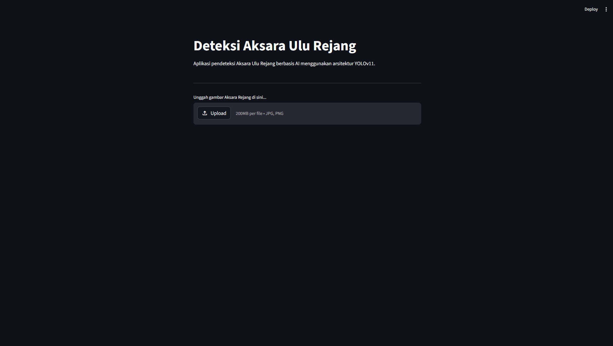
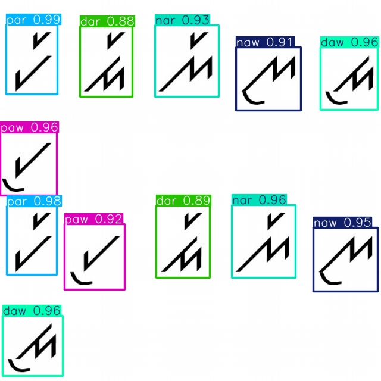
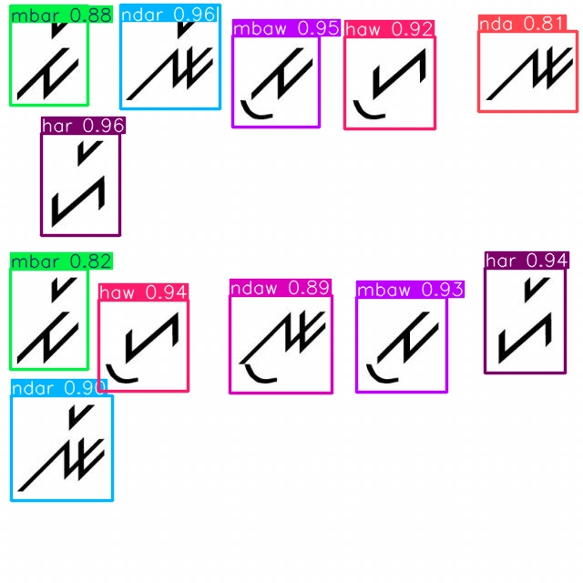
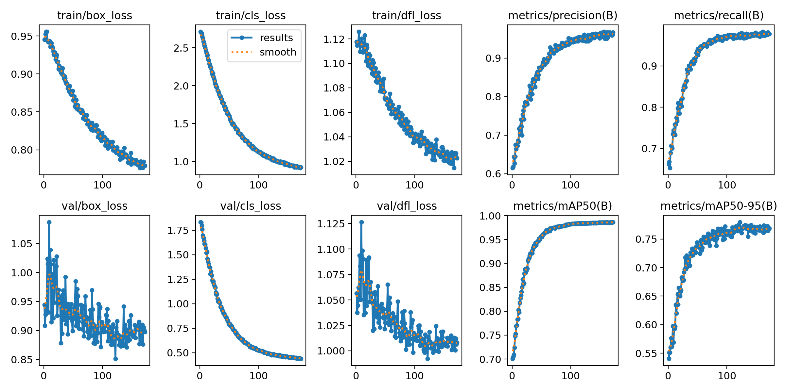
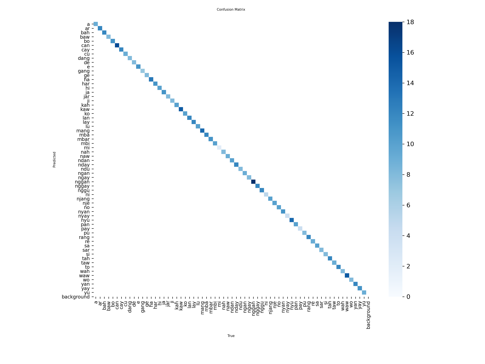
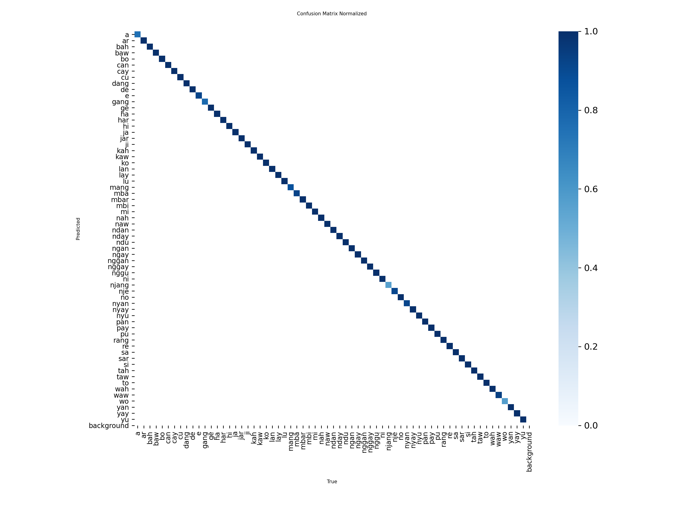
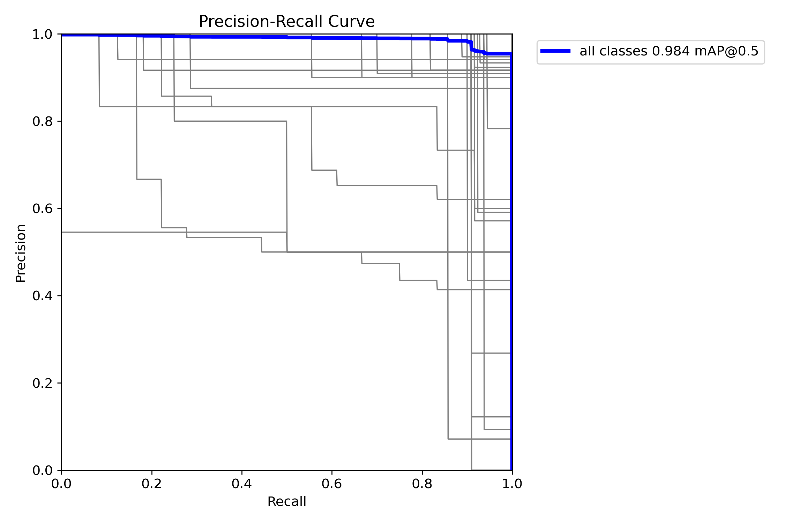
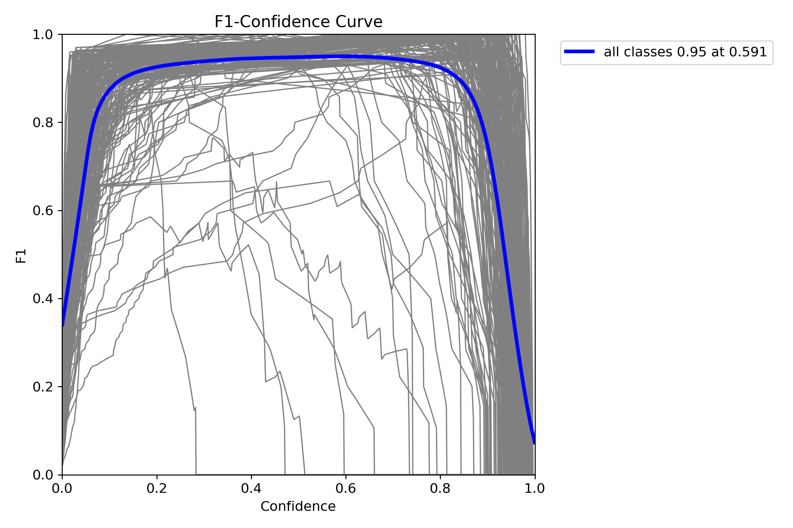
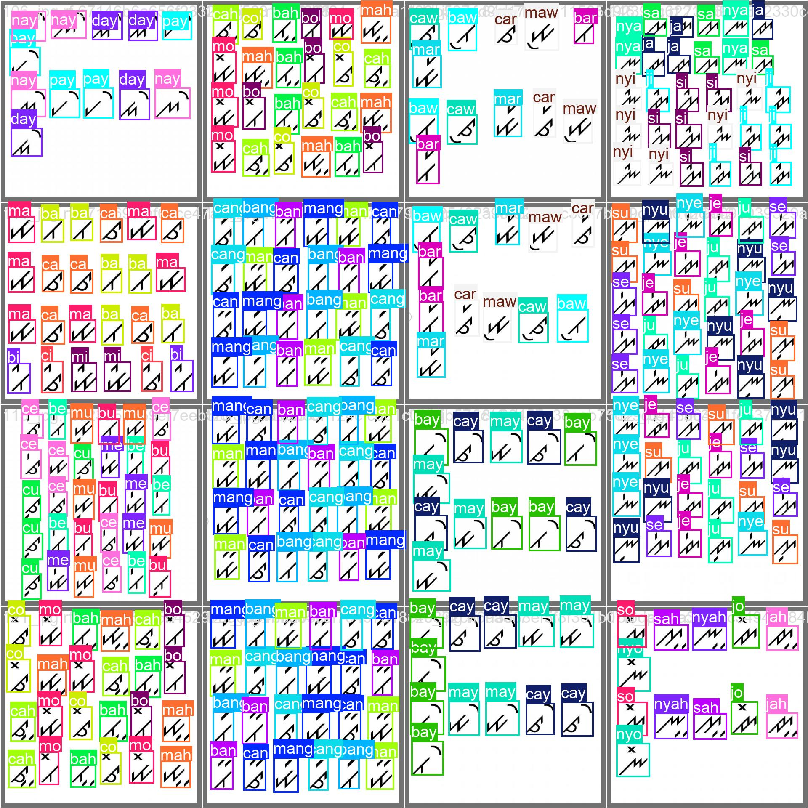
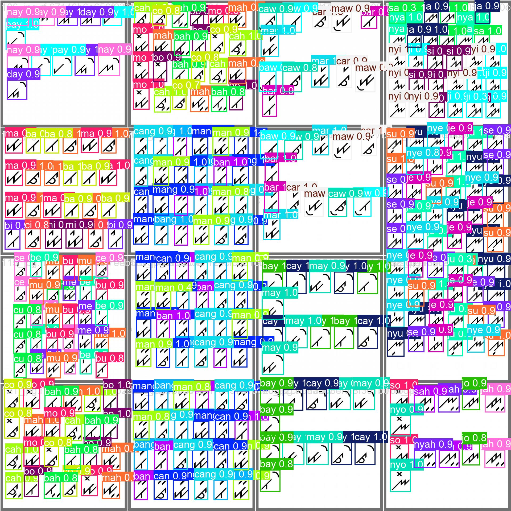

# 🔍 Sistem Deteksi Objek Aksara Ulu Rejang Berbasis YOLOv11

<div align="center">


Aplikasi web berbasis kecerdasan buatan untuk mendeteksi dan mengidentifikasi karakter **Aksara Ulu Rejang** dari gambar, dibangun menggunakan arsitektur **YOLOv11** dan antarmuka **Streamlit**.

</div>

---

## 📖 Tentang Proyek

**Aksara Ulu Rejang** adalah aksara tradisional yang digunakan oleh masyarakat Rejang di Provinsi Bengkulu, Sumatera Selatan. Proyek ini bertujuan untuk **melestarikan warisan budaya** tersebut melalui teknologi modern dengan membangun sistem deteksi objek berbasis *deep learning* yang mampu mengenali **253 kelas** karakter/suku kata aksara Rejang secara otomatis dari sebuah gambar.

Sistem ini dilatih menggunakan dataset dari Roboflow Universe dan dijalankan sebagai aplikasi web interaktif yang memudahkan siapa saja untuk mencoba deteksi aksara tanpa perlu keahlian teknis.

---

## ✨ Fitur Utama

- 🤖 **Deteksi Otomatis** — Identifikasi karakter Aksara Ulu Rejang dari gambar yang diunggah.
- 🟦 **Bounding Box Visual** — Menampilkan kotak deteksi beserta label kelas pada hasil prediksi.
- 🖼️ **Tampilan Perbandingan** — Menampilkan gambar asli dan hasil deteksi secara berdampingan.
- 🎯 **Threshold Confidence** — Hanya menampilkan prediksi dengan tingkat keyakinan di atas 50%.
- 🌐 **Antarmuka Ramah Pengguna** — Dibangun dengan Streamlit, mudah diakses melalui browser.

---

## 🖥️ Demo Aplikasi

### Tampilan Antarmuka



### Contoh Hasil Deteksi





---

## 📊 Hasil Pelatihan Model

### Kurva Training



### Confusion Matrix



### Normalized Confusion Matrix



### Precision-Recall Curve



### F1-Score Curve



### Validasi Prediksi

| Label | Prediksi |
|:-----:|:--------:|
|  |  |

---

## 🛠️ Teknologi yang Digunakan

| Teknologi | Versi | Keterangan |
|-----------|-------|------------|
| Python | 3.x | Bahasa pemrograman utama |
| [Ultralytics YOLOv11](https://github.com/ultralytics/ultralytics) | 8.4.46 | Model deteksi objek |
| [Streamlit](https://streamlit.io/) | 1.57.0 | Framework antarmuka web |
| Pillow | 12.2.0 | Pemrosesan gambar |
| NumPy | 2.4.4 | Operasi array numerik |

---

## 📁 Struktur Direktori

```
Sistem-Deteksi-Objek-Aksara-Ulu-Rejang-Berbasis-YOLOv11/
│
├── assets/                   # 🖼️ Gambar hasil pelatihan & demo aplikasi
│   ├── results.png           #    Kurva training (loss, mAP, precision, recall)
│   ├── confusion_matrix.png  #    Confusion matrix
│   ├── PR_curve.png          #    Precision-Recall curve
│   ├── F1_curve.png          #    F1-Score curve
│   └── ...                   #    Gambar hasil deteksi lainnya
│
├── models/                   # 🧠 Folder model terlatih (.pt)
├── script/                   # 📜 Skrip pendukung (training, evaluasi, dll.)
│
├── app.py                    # 🚀 Aplikasi web utama (Streamlit)
├── data.yaml                 # ⚙️ Konfigurasi dataset YOLO (253 kelas)
├── requirements.txt          # 📦 Daftar dependensi Python
├── README.dataset.txt        # ℹ️ Informasi dataset
├── README.roboflow.txt       # ℹ️ Informasi sumber dataset Roboflow
├── .gitignore
└── LICENSE
```

---

## 🚀 Cara Menjalankan

### 1. Clone Repositori

```bash
git clone https://github.com/likeazwee/Sistem-Deteksi-Objek-Aksara-Ulu-Rejang-Berbasis-YOLOv11.git
cd Sistem-Deteksi-Objek-Aksara-Ulu-Rejang-Berbasis-YOLOv11
```

### 2. Buat Virtual Environment (Opsional tapi Direkomendasikan)

```bash
python -m venv venv

# Windows
venv\Scripts\activate

# macOS/Linux
source venv/bin/activate
```

### 3. Instal Dependensi

```bash
pip install -r requirements.txt
```

### 4. Siapkan Model

Pastikan file model terlatih tersedia di path berikut:

```
runs/detect/Aksara_Rejang/training_v2_lanjutan/weights/best.pt
```

> Jika belum memiliki model, lakukan pelatihan terlebih dahulu menggunakan skrip yang tersedia di folder `script/` dengan dataset yang dikonfigurasi di `data.yaml`.

### 5. Jalankan Aplikasi

```bash
streamlit run app.py
```

Buka browser dan akses `http://localhost:8501`.

---

## 🖱️ Cara Penggunaan Aplikasi

1. Buka aplikasi di browser.
2. Klik tombol **"Browse files"** untuk mengunggah gambar (format: `.jpg`, `.jpeg`, `.png`).
3. Gambar asli akan langsung ditampilkan di kolom **kiri**.
4. Klik tombol **"Deteksi Aksara"** untuk memulai proses deteksi.
5. Hasil deteksi beserta *bounding box* dan label akan ditampilkan di kolom **kanan**.

---

## 📊 Dataset

Dataset yang digunakan bersumber dari **Roboflow Universe**:

| Properti | Detail |
|----------|--------|
| **Nama Proyek** | Aksara Ulu Rejang |
| **Versi** | 4 |
| **Jumlah Kelas** | 253 suku kata/karakter |
| **Lisensi** | CC BY 4.0 |
| **Sumber** | [universe.roboflow.com/.../aksara-ulu-rejang](https://universe.roboflow.com/novalrizkiansyah-ymail-com/aksara-ulu-rejang/dataset/4) |

Dataset mencakup suku kata lengkap aksara Rejang, mulai dari vokal tunggal (`a`, `i`, `u`, `e`, `o`) hingga kombinasi konsonan-vokal kompleks seperti `ngga`, `nggah`, `mbang`, `ndan`, dan sejenisnya — total **253 kelas unik**.

<details>
<summary>📋 Lihat Daftar Semua Kelas (253 kelas)</summary>

```
a, ah, an, ang, ar, aw, ay,
ba, bah, ban, bang, bar, baw, bay, be, bi, bo, bu,
ca, cah, can, cang, car, caw, cay, ce, ci, co, cu,
da, dah, dan, dang, dar, daw, day, de, di, do, du,
e,
ga, gah, gan, gang, gar, gaw, gay, ge, gi, go, gu,
ha, hah, han, hang, har, haw, hay, he, hi, ho, hu,
i,
ja, jah, jan, jang, jar, jaw, jay, je, ji, jo, ju,
ka, kah, kan, kang, kar, kaw, kay, ke, ki, ko, ku,
la, lah, lan, lang, lar, law, lay, le, li, lo, lu,
ma, mah, man, mang, mar, maw, may,
mba, mbah, mban, mbang, mbar, mbaw, mbay, mbe, mbi, mbo, mbu,
me, mi, mo, mu,
na, nah, nan, nang, nar, naw, nay,
nda, ndah, ndan, ndang, ndar, ndaw, nday, nde, ndi, ndo, ndu,
ne,
nga, ngah, ngan, ngang, ngar, ngaw, ngay, nge,
ngga, nggah, nggan, nggang, nggar, nggaw, nggay, ngge, nggi, nggo, nggu,
ngi, ngo, ngu, ni,
nja, njah, njan, njang, njar, njaw, njay, nje, nji, njo, nju,
no, nu,
nya, nyah, nyan, nyang, nyar, nyaw, nyay, nye, nyi, nyo, nyu,
o,
pa, pah, pan, pang, par, paw, pay, pe, pi, po, pu,
ra, rah, ran, rang, rar, raw, ray, re, ri, ro, ru,
sa, sah, san, sang, sar, saw, say, se, si, so, su,
ta, tah, tan, tang, tar, taw, tay, te, ti, to, tu,
u,
wa, wah, wan, wang, war, waw, way, we, wi, wo, wu,
ya, yah, yan, yang, yar, yaw, yay, ye, yi, yo, yu
```

</details>

---

## ⚙️ Konfigurasi Model

Model dijalankan dengan konfigurasi berikut pada `app.py`:

```python
# Confidence threshold untuk prediksi
conf = 0.5  # Hanya tampilkan prediksi dengan keyakinan > 50%

# Path model terlatih
model_path = r"models/best.pt"
```

---

## 📄 Lisensi

Proyek ini dilisensikan di bawah lisensi **MIT**. Lihat file [LICENSE](LICENSE) untuk informasi lebih lanjut.

Dataset yang digunakan dilisensikan di bawah **CC BY 4.0** oleh kontributor di Roboflow Universe.

---

## 🙏 Ucapan Terima Kasih

- [Ultralytics](https://github.com/ultralytics/ultralytics) atas framework YOLOv11 yang luar biasa.
- [Roboflow](https://roboflow.com/) atas platform anotasi dan hosting dataset.
- **novalrizkiansyah** atas kontribusi dataset Aksara Ulu Rejang di Roboflow Universe.
- Seluruh komunitas yang telah berkontribusi dalam pelestarian Aksara Ulu Rejang.

<div align="center">

</div>
